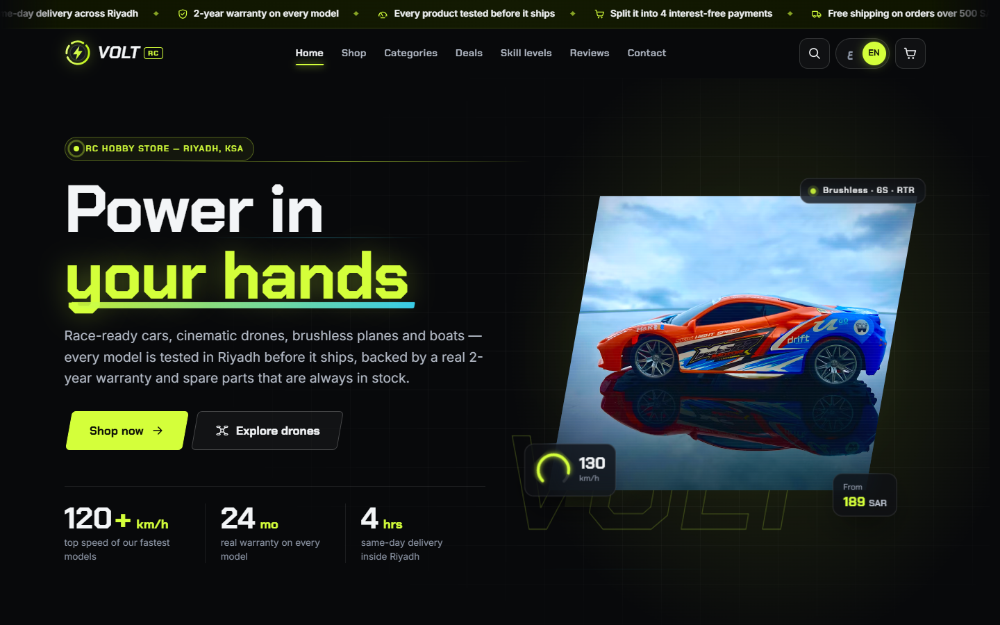
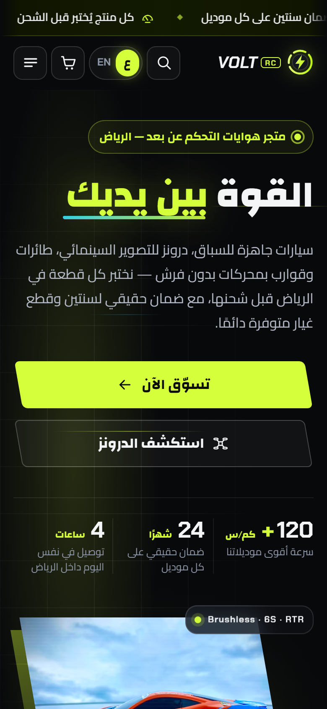

# ⚡ VOLT RC

**A bilingual online store for radio-controlled cars, drones, planes and boats**

**[▶ Live demo](https://invisablesam-designs.github.io/volt-rc-store/)**

> Concept design project — designed and developed by **Sam**. VOLT RC is a fictional brand; products, prices and reviews are sample content.

## Features

- **Arabic & English** — one-click language switch with full right-to-left / left-to-right layout, remembered between visits
- **Real shop experience** — 24 products with filters (category, brand, skill level, price range, in stock), live search and sorting
- **Quick view** — product pop-up with a full specs table and quantity selector
- **Slide-in cart** — quantity controls, free-shipping progress, 15% VAT and totals, saved in the browser
- **Deal of the week** — live countdown timer
- **Shop by skill level** — beginner, intermediate and pro picks
- **Reviews carousel**, validated contact and newsletter forms, back-to-top with scroll progress
- **Responsive & accessible** — phones to wide screens, keyboard friendly, respects reduced-motion settings

## Built with

HTML5 · CSS3 · vanilla JavaScript — no frameworks, no build step.

---

## ‏VOLT RC — متجر إلكتروني ثنائي اللغة

متجر إلكتروني لهواة سيارات وطائرات وقوارب التحكم عن بعد.

**[▶ معاينة الموقع مباشرة](https://invisablesam-designs.github.io/volt-rc-store/)**

> مشروع تصميمي تجريبي — تصميم وتطوير **Sam**. العلامة التجارية والمنتجات والأسعار والتقييمات محتوى تجريبي.

### المزايا

- **العربية والإنجليزية** — تبديل فوري بين اللغتين مع تغيير اتجاه الصفحة بالكامل وحفظ الاختيار
- **تجربة تسوق حقيقية** — ‏24 منتجًا مع فلترة حسب القسم والعلامة ومستوى المهارة والسعر والتوفر، مع بحث مباشر وترتيب
- **عرض سريع** — نافذة منبثقة بجدول مواصفات كامل واختيار الكمية
- **سلة جانبية** — التحكم بالكمية وشريط الشحن المجاني وضريبة القيمة المضافة والإجمالي، مع حفظ السلة في المتصفح
- **عرض الأسبوع** — عداد تنازلي مباشر
- **التسوق حسب مستوى المهارة** — مبتدئ ومتوسط ومحترف
- **آراء العملاء** بشريط متحرك، ونماذج تواصل واشتراك مع التحقق من البيانات
- **تصميم متجاوب وسهل الاستخدام** — من الجوال حتى الشاشات العريضة، ويدعم التنقل بلوحة المفاتيح

### التقنيات المستخدمة

‏HTML5 و CSS3 و JavaScript دون أي مكتبات جاهزة.

